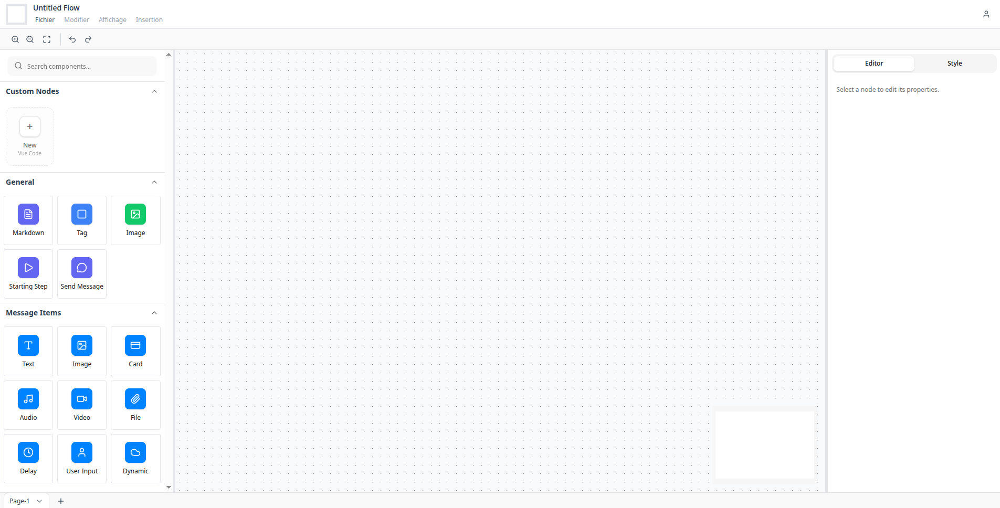

# Messaging Bot Flowchart

[](https://opensource.org/licenses/MIT)

A modern, TypeScript-based flowchart builder for designing messaging bot interactions. Built with [Vue Flow](https://github.com/bcakmakoglu/vue-flow), [Pinia](https://pinia.vuejs.org/), and [Tailwind CSS](https://tailwindcss.com/), this tool provides an intuitive visual interface for creating and managing complex bot conversation flows. All flowcharts can be exported and imported as JSON files for easy sharing and version control.

## Features

- **Modern TypeScript Stack**: Full TypeScript migration for enhanced type safety and developer experience
- **Tailwind CSS Styling**: Modern, responsive UI with Tailwind CSS integration
- **Dynamic Node System**: Create custom nodes with a flexible registry system
- **Monaco Editor**: Built-in code editor for markdown and custom node editing
- **Resizable Panels**: Intuitive workspace with draggable sidebars and canvas
- **Context Menus**: Right-click functionality for quick node actions
- **Multiple Node Types**: Message nodes, Markdown nodes, Tag nodes, Image containers, and more
- **Message Editor**: Visual editor for adding text, images, cards, videos, delays, and user inputs
- **Keyboard Shortcuts**: Full support for Vue Flow shortcuts (BackSpace to delete, Shift for multi-select)
- **Export/Import**: Save and share flowcharts as JSON files

## Screenshoot



## Node Types

### Core Nodes

- **Message Node**: The primary node for messaging interactions. Contains multiple message items (text, images, cards, videos, etc.). Double-click to open the editor.
- **Starting Step**: Entry point node for conversation flows
- **Tag Node**: Label and organize different parts of your flowchart
- **Markdown Node**: Rich text documentation node with Monaco Editor integration
- **Image Container**: Display images directly in the flowchart
- **Custom Node**: Create dynamic custom nodes using the built-in SFC compiler

### Node Registry System

The application uses a dynamic node registry that allows for easy extension and customization. New node types can be registered programmatically with their own editors and renderers. See `DYNAMIC_NODES.md` for implementation details.

### Custom Edges

Custom edges are rendered as SVG paths with intelligent styling. The edge system handles various connection scenarios and provides visual feedback for different connection states.

## Message Components

The Message Editor provides a rich set of components for building messaging interactions. Access it by selecting a Message Node.

### Available Message Types

- **Text Message**: Simple text with support for up to three action buttons
- **Image**: Display images with optional button actions
- **Card**: Rich card format with image, title, subtitle, three buttons, and default action
- **Video**: Embed and play videos directly in the flowchart
- **Audio**: Audio message component
- **File**: File attachment representation
- **Delay**: Add timed delays between messages
- **User Input**: Capture user responses
- **Dynamic**: Dynamic content placeholder

### Editor Features

- **Visual Editor**: Right sidebar displays context-aware editors for selected nodes
- **Drag & Drop**: Reorder message items within the message editor
- **Live Preview**: See changes in real-time as you edit

## User Interface

### Layout

- **Left Sidebar**: Node templates that can be dragged onto the canvas
- **Canvas**: Main workspace with zoom, pan, and node manipulation
- **Right Sidebar**: Context-aware editors for selected nodes
- **Top Menu Bar**: Save, restore, import, and export functionality
- **Bottom Bar**: Flow controls and additional tools

### Context Menu

Right-click on any node to access quick actions:

- **Duplicate**: Create a copy of the selected node
- **Delete**: Remove the node from the canvas
- **Edit**: Open the dedicated editor for the node type

### Resizable Panels

The workspace uses resizable panels that can be adjusted by dragging the panel dividers, allowing you to customize your workspace layout.

## Save - Restore - Import - Export

These four functionalities help to save locally and share the generated flowchart.

- **Save**: This option will save the current state of the flowchart to the localStorage.
- **Restore**: The Restore option works with the `Save` one, to restore directly the latest saved state by replacing all of it.
- **Export**: When this option is chosen, the latest state will be exported to a file, in this case, downloaded.
- **Import**: A valid exported file can be imported and stored as a new saved state that we can `Restore`.

## Project Setup

This is a Vue 3 + TypeScript application built with Vite.

### Prerequisites

- Node.js 16+ or Bun
- npm or bun package manager

### Installation

```sh
npm install
# or
bun install
```

### Development

Compile and hot-reload for development:

```sh
npm run dev
# or
bun run dev
```

### Production Build

Compile and minify for production:

```sh
npm run build
# or
bun run build
```

### Linting

```sh
npm run lint
# or
bun run lint
```

## Tech Stack

This project is built with:

- **[Vue 3](https://vuejs.org/)** - Progressive JavaScript framework
- **[TypeScript](https://www.typescriptlang.org/)** - Type-safe development
- **[Vite](https://vitejs.dev/)** - Fast build tool and dev server
- **[Vue Flow](https://github.com/bcakmakoglu/vue-flow)** - Flowchart and diagram library
- **[Pinia](https://pinia.vuejs.org/)** - State management
- **[Tailwind CSS](https://tailwindcss.com/)** - Utility-first CSS framework
- **[shadcn-vue](https://www.shadcn-vue.com/)** - UI component library
- **[Monaco Editor](https://microsoft.github.io/monaco-editor/)** - Code editor
- **[Radix Vue](https://www.radix-vue.com/)** - Unstyled, accessible UI primitives
- **[Lucide Icons](https://lucide.dev/)** - Beautiful icon set

## License

MIT License - see LICENSE file for details 
